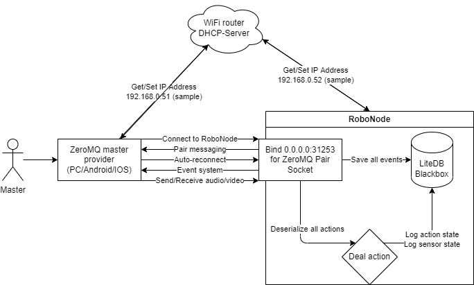
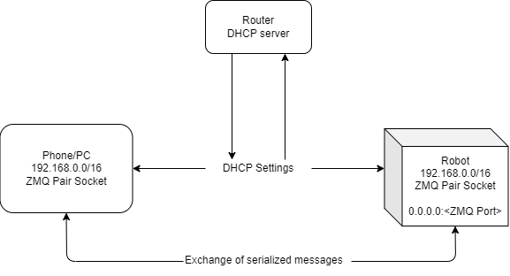
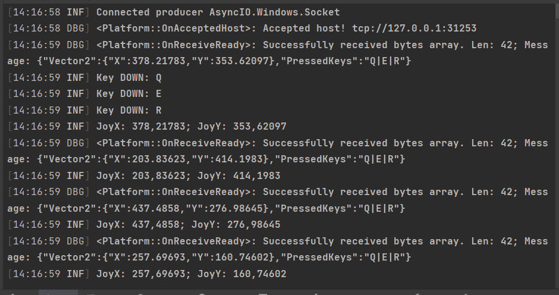

# Robotics/IOT .NET Core

## Дисклеймер

___
## Используемые библиотеки и приложения

| Наименование | Применение |
|--|--|
| **Библиотеки** |
|[MessagePack](https://msgpack.org/) | Используется для сериализации/десериализации сообщений между клиентом и роботом |  
|[Serilog](https://serilog.net/) | Используется для логирования информации и сохранения ее в базу данных |    
|[LiteDB](https://www.litedb.org/) | NoSQL-хранилище для хранения логов |  
|[System.Device.GPIO](https://learn.microsoft.com/ru-ru/dotnet/iot/) | Библиотека для работы с IOT |  
|[NetMQ](https://netmq.readthedocs.io/en/latest/) | Библиотека для работы с библиотекой [ZeroMQ](https://zeromq.org/). Используется для TCP-сокетов |  
|[nanoFramework](https://www.nanoframework.net/) | Библиотека для написания кода на C# для IOT |  
| **Приложения** |
| [LiteDB.Studio](https://github.com/mbdavid/LiteDB.Studio) | Приложение для просмотра и редактирования LiteDB |

___
## Общая схема работы проекта

0. *Робот* подключается к WiFi и получает сетевые настройки.
1. Пользователь *Master* подключается к WiFi сетевые настройки.  
2. Пользователь *Master* запускает приложение для установления сетевого соединения с роботом. В приложении:  
    2.1 Производится станирование сети  
    2.2 В случае успешного нахождения устройства, производится подключение к нему  
3. После успешного установления сетевого соединения идет обмен данными в режиме реального времени и логирование данных в [*черный ящик*](https://ru.wikipedia.org/wiki/%D0%91%D0%BE%D1%80%D1%82%D0%BE%D0%B2%D0%BE%D0%B9_%D1%81%D0%B0%D0%BC%D0%BE%D0%BF%D0%B8%D1%81%D0%B5%D1%86)

### Хранение данных 
В качестве системы хранения данных (логирование), используется NoSQL-хранилище (*[LiteDB](https://www.litedb.org/)*)  

Суммарно, хранится **три сессии** данных, остальные удаляются ввиду отсутствия какой-либо необходимости и с целью сохранить память на MicroSD.  
___
## Схема взаимодействия 

Передача и получение трафика производятся с использованием [ZeroMQ](https://zeromq.org/) с использованием **Pair Socket**   
> В предыдущей версии использовался принцип *Pull/Push*, где в роли получающего был непосредственно робот, но, ввиду того, что я решил направлять данные в обе стороны, было принято отказаться от данного подхода  

Отправляемые клиентом и получаемые данные роботом должны быть представлены [сериализованной моделью](./Platform/Models/InputControllerModel.cs)  

Отправляемые данные роботом получаемые данные клиентом должны быть представленны [сериализованной моделью](./Platform/Models/RoboDataModel.cs)  

Пример данных, которые получает робот и преобразовывает в действие:  
  
___
## TODO List

- [ ] Портировать код на Raspberry Pi 3  
- [ ] Написать приложение для управления роботом  
- [ ] Настроить двунаправленную передачу реальных, а не тестовых данных  
- [ ] Подключить модули управления к GPIO И настроить подключение их к платформе  
