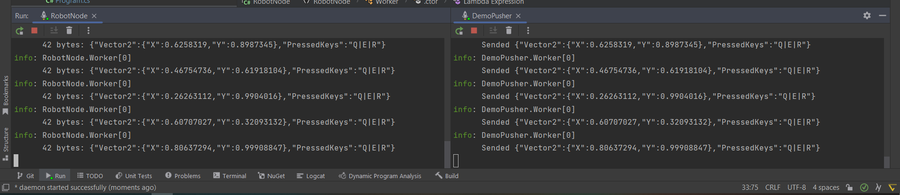

# My robotics-pet project
# Управление
Управление роботом производится мобильного устройства  посредством использования гироскопа (в текущей реализации телефон на Android (Redmi 9))  

Ввиду технических особенностей джойстика (данные с потенциометров по осям X и Y могут принимать значения от 0 до 1023), необходимо производить корреляцию данных с гироскопа мобильного устройства (значения от -1 до 1)
```csharp 
Vector2 GyroscopeToJoystickConversion(Vector2 gyroPos) {
    // x from -1.0 - 0.5 - 1.0
    // X from 0 - 511 - 1023
    const float joyZeroEmulation = 511.5f; 

    var x = joyZeroEmulation * gyroPos.X + (gyroPos.X > 0 ? gyroPos.X : -gyroPos.X);
    var y = joyZeroEmulation * gyroPos.Y + (gyroPos.Y > 0 ? gyroPos.Y : -gyroPos.Y);

    return new Vector2(x, y);
}
```
___
# Взаимодействие
1. Роутер является DHPC-сервером.  
2. Поиск ботов идет посредством протокола SSDP на манипуляторе пользователя (Необходимо нахождение устройств в одной сети).  
    2.1 Подключение к устройству идет по заранее определеленному константному порту.  
3. На устройстве-манипуляторе есть обработчик событий коннекта и дисконнекта  




## Модель взаимодействия

1. Передача и получение трафика производятся с использованием [ZeroMQ](https://zeromq.org/) по протоколу **Push/Pull**  
2. Сериализация и десериализация сообщений производится с использованием [MessagePack](https://msgpack.org/)  
3. Общая DTO-модель 

```csharp
public class TransportDto {
    public Vector2 Vector2 { get; set; }
    public string PressedKeys { get; set; }
}

public class Vector2 {
    public float X { get; set; }
    public float Y { get; set; }

    public Vector2(float x, float y) {
        X = x;
        Y = y;
    }
}
```
> **X** - Координаты смещения по X-оси (поворот).  
>> *511* - zero point  
>> *1023* - max right  
>> *0* - max left  

> **Y** - Координаты смещения по Y-оси (вперед - назад).  
>> *511* - zero point  
>> *1023* - max acceleration  
>> *0* - reverse acceleration  

> **Pressed keys** - нажатые в текущий момент времени клавиши  
>> Message format: Z|X|C|V|B|N|M;  
>> *|* - delimiter  


